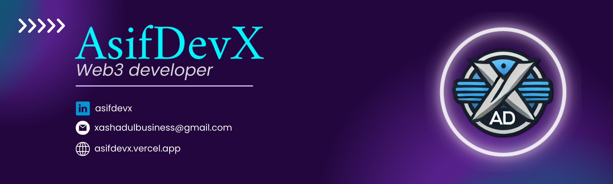

  

<h1 align="center">Hi 👋, I'm AsifDevX</h1>
<h3 align="center">🚀 Web3 Developer | Frontend & Blockchain Expert | 3+ Years of Experience</h3>

  <table>
    <tr>
      <td width="65%">
        <ul>
          <li>🌱 Currently Learning: <strong>Rust</strong></li>
          <li>👨‍💻 Projects: <a href="https://asifdevx.vercel.app">asifdevx</a></li>
          <li>📫 Contact: <strong>xashadulbusiness@gmail.com</strong></li>
          <li>🎓 Education: Postgraduate in Computer Science</li>
        </ul>
      </td>
      <td align="center" width="35%">
        
      </td>
    </tr>
  </table>

<h3 align="center">💻 Tech Stack & Tools:</h3>

<h3 align="center">🔥 GitHub Stats:</h3>

  
  

  

