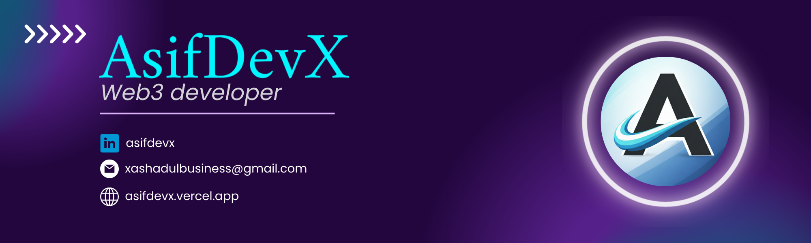

 

<h1>
  
</h1>

 

  
  &nbsp;
  
  &nbsp;
  
  &nbsp;
  
  &nbsp;
  

 

  
  &nbsp;&nbsp;
  
  &nbsp;&nbsp;
  

---

## 👨‍💻 About Me

> *Building the decentralized future — one smart contract at a time.*

I'm a **Web3 & Full-Stack Developer** with **4+ years** of hands-on experience designing and shipping production-grade decentralized applications, smart contracts, and modern web experiences.

My work spans the full stack — from writing secure **Solidity** contracts and building **DeFi** integrations, to crafting polished **React / Next.js** frontends backed by robust **Node.js** APIs. I care deeply about clean architecture, performance, and user experience.

Currently expanding into **Rust** 🦀 for systems-level and on-chain performance work.

 

| 🎓 | Postgraduate in Computer Science |
|---|---|
| 💼 | Open to freelance — [fiverr.com/asifdevx](https://fiverr.com/asifdevx) |
| 🌐 | Portfolio — [asifdevx.vercel.app](https://asifdevx.vercel.app) |
| 📧 | [xashadulbusiness@gmail.com](mailto:xashadulbusiness@gmail.com) |
| 🌍 | Bangladesh |

 

---

## 🛠️ Tech Stack

 

**`⛓️  BLOCKCHAIN & WEB3`**

 

**`💻  LANGUAGES`**

 

**`🎨  FRONTEND`**

 

**`⚙️  BACKEND & DATABASE`**

 

**`🔧  TOOLS & PLATFORMS`**

 

---

## 📊 GitHub Stats

<table border="0" cellspacing="0" cellpadding="8">
  <tr>
    <td align="center">
      
    </td>
    <td align="center">
      
    </td>
  </tr>
  <tr>
    <td colspan="2" align="center">
      
    </td>
  </tr>
</table>

 

---

## 🏆 GitHub Trophies

  <picture>
    <!-- Dark Mode Theme (Radical/Modern) -->
    <source media="(prefers-color-scheme: dark)" srcset="https://github-profile-trophy.vercel.app/?username=asifdevx&theme=radical&no-frame=true&no-bg=true&column=4&margin-w=15&margin-h=15" />
    <!-- Light Mode Theme (Flat/Clean) -->
    <source media="(prefers-color-scheme: light)" srcset="https://github-profile-trophy.vercel.app/?username=asifdevx&theme=flat&no-frame=true&no-bg=true&column=4&margin-w=15&margin-h=15" />
    
  </picture>

 

---

## 📈 Contribution Activity

 

 

---

## 💼 Available for Freelance

**Need a Smart Contract, DApp, or Full-Stack Web App?**  
Let's build something great — on time, on budget, and production-ready.

 

&nbsp;&nbsp;

 

*"Code is poetry. Smart contracts are the new law."*

  

